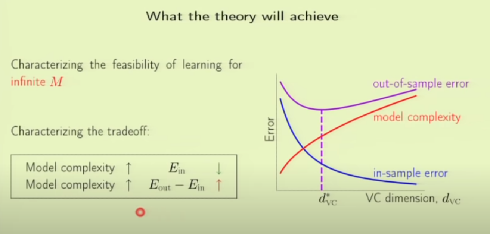

# Lecture 04 - Error and Noise

- Solving a non linear problem:
    1. get the non linear data
    2. transform it to a linear configuration
    3. classify in a linear configuration
    4. interpret in a non linear configuration based on the previous classification
- To know if a problem is solvable by machine learning, we need to make sure that: 
    1. the error in sample is close to error out of sample: this is a purely theorical condition, since the population is out of reach.
    2. the error in sample is small enough.
- Theory of the Learning problem:

stopped at:
https://youtu.be/L_0efNkdGMc?t=3572