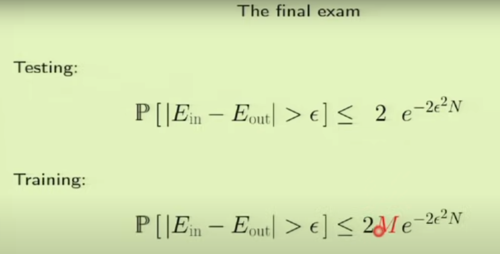
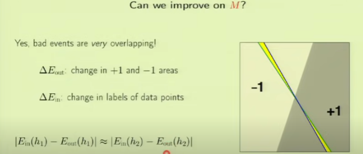
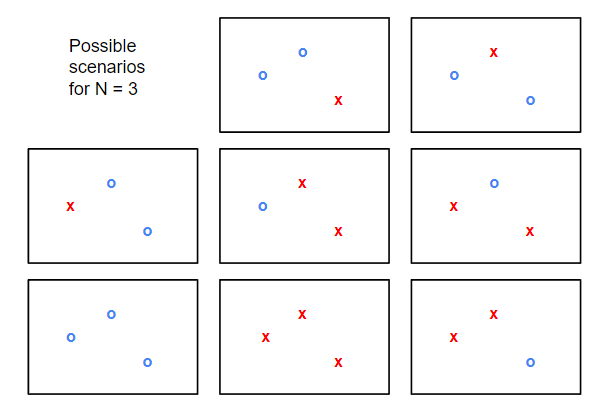
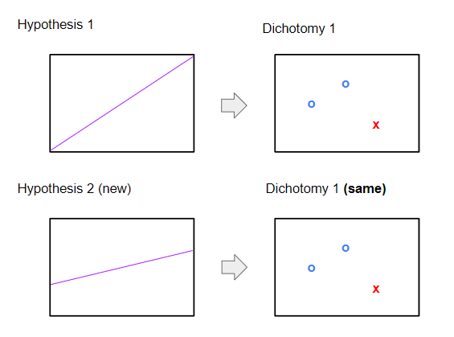
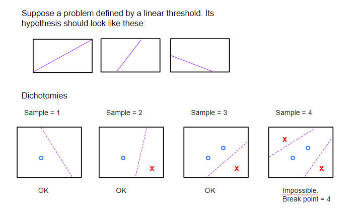
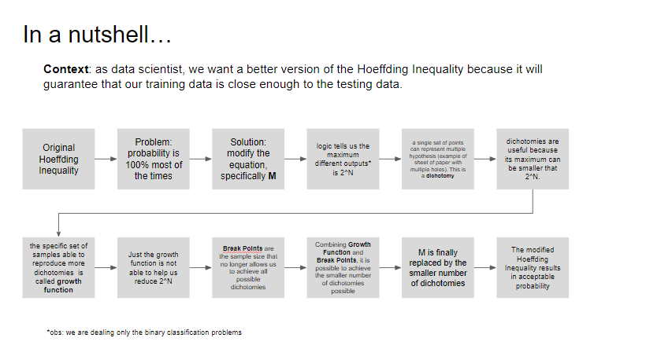

# Lecture 05 - Training versus Test

## Objective
Introduce practical mathematical ways of distinguish training error and test error.

## Hoeffding Inequality
Revisiting Hoeffding Inequality introduced in lecture 02, it is possible to establish a theoretically probability for in sample error and out of sample error to be acceptable:

For the training equation **M** accounts for the iterations necessary to train the model, and the catch is: in practice this number is big and the final probability becomes 1.

> **Q**: *"M indicates the errors of each iteration sums to the others. Shouldn't we pick the error exclusively of the final and better model?"*

> **A**: No, with each iteration the model learn more from the sample, resulting in a smaller in sample error and consequently a smaller probability. Therefore, M constitutes a penalty element for the training process.

The next step is to rework M to better suit us.

## Finding a better **M**

Theoretically, **M** being the sum of all errors is a **conservative** approach since it carries the maximum error during all iterations. It means also that a element that qualifies as a error will be accounted at every single iteration the error persists. It is not a efficient and it may needlessly invalidate a good hypothesis.

One possible approach is to consider only the marginal error increased at each iteration. The figure below illustrate it:

Suppose each iteration moves the threshold line a little bit, and both the blue and green lines represent this evolution. Yellow area represent the marginal error increase. The modifications in **M** will require that the yellow area resulted of each iteration change are equivalent.

Instead of considering the area, is possible to consider only the elements of sample and their prediction. In a binary classification problem, when given 3 elements, there are **2^N** possible scenarios:

Each scenario above have an associated hypothesis, and it could be used as a substitute for **M** applied in Hoeffding's Inequality. Although **2^N** is still a large number, it tends to be smalled than **M** iterations used to produce the final hypothesis for any model. What we will try to do next will be to decrease even more **2^N**.

## Dichotomy

In each interaction a new hypothesis will be formulated. This new hypothesis will define the mathematical domain in which a new point will be classified accordingly. Suppose in a given hypothesis just a few points are classified. It is possible however that the same classification are maintained to a completely different hypothesis (image below).

In the cenario described, while the hypothesis change, the **dichotomy** may stay the same.

**Why are we learning this:**
contrary to the hypothesis, dichotomies are **finite**. While a problem may have infinite hypothesis (since different mathematical domains are generated every time), the dichotomy will be capped by the sample size (2^N). In addition, depending on the set of sample, it is possible to achieve a smaller dichotomy quantity, which is even better for us. 

 **Growth Function** is a set of samples organized in a specifically layout (i.e. "shattered") that achieve the most dichotomies for a problem.

By definition:
> *"The growth function counts the most dichotomies on any N points"*

## Weakness of Growth Function

The examples on the lecture illustrates that specific arrangements of samples allows to establish the maximum amount of dichotomies (i.e. to *"shatter"* the dataset). Unfortunatly is unlikely that we will face the same specific arrangements in different dichotomies.

## Break Point

**Definition:** 
number of sample that is no longer possible to achieve all possible dichotomies.

In practice, **Break Point** (or BP in short) will be used as a measure of the complexity of the learning process. A learning process with BP = 2 will be a simpler one dimensional problem, where a learning process with BP = 4 will be a more complex two dimensional problem. 

If a hypothesis have a finite break point, than a new **M** is possible. That modified **M** is now a polynommial and now the Hoeffding Inequation results in a smaller probability (**not sure why polinomial M is better though**).

## Conclusion

Video: https://www.youtube.com/watch?v=SEYAnnLazMU
