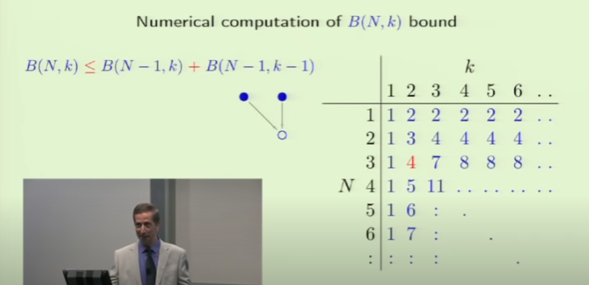
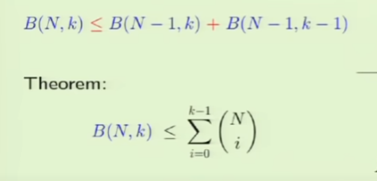
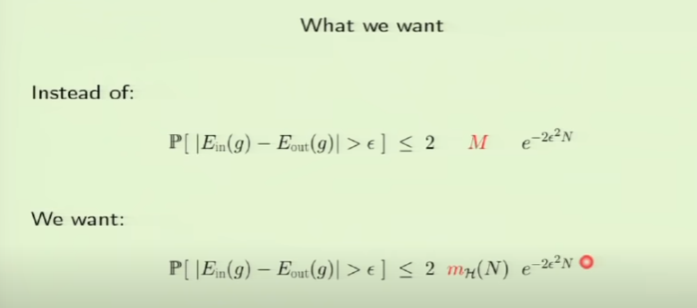
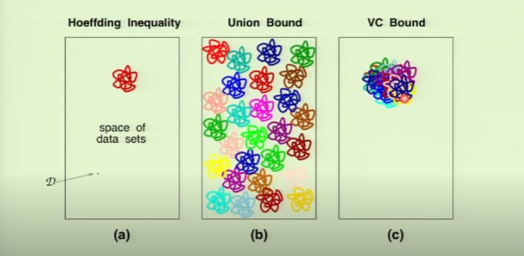
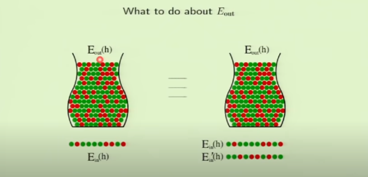
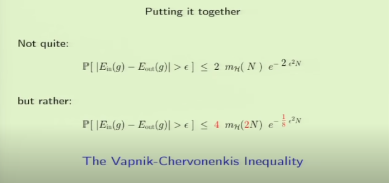

# Lecture 06 - Theory of Generalization

## Objective
1. Demonstrate the Growth Function with Break Point leads to a polynomial equation.
2. Demonstrate the Growth Function with Break Point can replace **M** in Hoeffding Inequality.

## Recursive Bound

> $B(N, k)$: *"number of dichotomies with sample N and break point k"*

The previous puzzle is represented by B(3, 2) and it is represented in the table below:

| Category  | Number of rows | x1, x2 | x3 |
| --------  | -------------- | ------ | -- |
| S1        | alpha          |  1, 0  | 0  |
|           |                |  0, 1  | 0  |
| S2-       | beta           |  0, 0  | 0  |
| S2+       | beta           |  0, 0  | 1  |

### Train of Thought
1. the whole table have $alpha + 2 * beta = B(N, k)$ lines or dichotomies;
2. if we ommit x3, the S2- and S2+ category becomes identical and therefore one of them can be discarded. After this, the number of rows can be represented as $alpha+beta \leq B(N-1, k)$;
3. again, when omitting x3, the only difference between S2- and S2+ is omitted, which is the same as subtracting one Break Point from the problem. Therefore, it can be represented as $beta \leq B(N-1, k-1)$; 
4. rearranging the terms, we have $B(N, k) = alpha + 2*beta \leq B(N-1, k) + B(N-1, k-1)$.
5. now, the number of dichotomies is represented not by a monomial, but by a polynomial. This is great, because in the last lecture we were told that if we calculate the Hoeffding Inequality substituting **M** by a polynomial, the probability tends to get smaller more efficiently.

The table below shows the number of dichotomies obtained from a specific set of sample size (N) and break point (k):

### Theorem

The examples can be shown by:

[Example 1: positive ray (k = 2)](https://www.wolframalpha.com/input?i=N%21%2F%280%21+*+%28N+-+0%29%21%29+%2B+N%21%2F%281%21+*+%28N+-+1%29%21%29)

[Example 2: positive interval (k = 3)](https://www.wolframalpha.com/input?i=N%21%2F%280%21+*+%28N+-+0%29%21%29+%2B+N%21%2F%281%21+*+%28N+-+1%29%21%29+%2B+N%21%2F%282%21+*+%28N+-+2%29%21%29)

[Example 3: 2D perceptron (k = 3)](https://www.wolframalpha.com/input?i=N%21%2F%280%21+*+%28N+-+0%29%21%29+%2B+N%21%2F%281%21+*+%28N+-+1%29%21%29+%2B+N%21%2F%282%21+*+%28N+-+2%29%21%29+%2B+N%21%2F%283%21+*+%28N+-+3%29%21%29)

### Q & A

> *"Why are isolating x3 from x1 and x2?"*

Because it allows a recursion, which means a solution applicable to smaller N. (?)

## Applying the Growth Function into Hoeffding Inequality

Our objective is to:

### How does Groth Function relate do overlaps

The Growth Function will guarantee that all dichotomies will overlap most of the sample instead of distributing them along the population dominion. This allows us to avoid summing each error term, which would result in gigantic probabilities that the error in sample would be bigger than the threshold established. The new configuration is called **VC Dimension**.

### What to do about **Eout**

This topic illustrates why the number of hypothesis affects negatively our model. As we obtain more and more samples from the population, we get higher probability of picking a sample that differs greatly from the population, just like a sample composed exclusively by red marbles (figure below). Any machine learning model would suffer if tasked with predicting a classification based on such sample.

### Putting together

The modified version of Hoeffding Inequality is known by **Vapnik-Chervonenkis Inequality**.

Video: https://youtu.be/6FWRijsmLtE?t=4226
