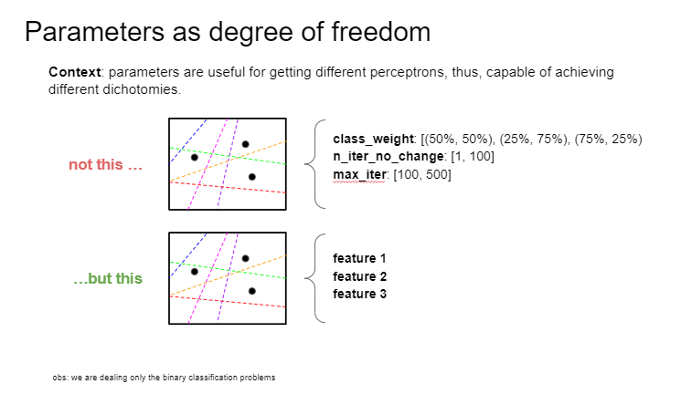

# Lecture 07 - The VC dimension

## Objective
1. Introduce the main concepts of VC dimension.
2. Demonstrate the Growth Function with Break Point leads to a polynomial equation.
3. Demonstrate the Growth Function with Break Point can replace **M** in Hoeffding Inequality.

## Definition
VC dimensions it is the most points of a subsample that a specific hypothesis family (i.e. learning algorithm) can shatter.

**Remember**: to shatter a sample means that using only a specific hypothesis family (e.g. straight lines with different starting points and/or angles) it should be possible to reproduce all possible labels for every element.

### Perk 1: Generalization
Given (1) a dataset and (2) a hypothesis set, the VC dimension varies from 1 to infinite. What we are looking for is a finite VC dimension, for it allows us to achieve a polynomial version of the Hoeffding Inequality. In addition, as the VC dimensions is finite, we can be sure (how?) the results can be generalized by any learning algorithm (i.e. hypothesis set). In other words, once a finite VC dimension is achieved by a specific learning algorithm, all other algorithm can be used (why?). 

### Perk 2: Probability distribution
As VC dimensions is finite, the second perk of it is to disregard the probabilty distribution of both population and sample. The logic is:

- a dichotomiy is obtained by organizing a subsample in a specific way that allows it to be shatterd by a hypothesis set;
- the specific configuration of the subset in theory could be obtained from any probability distribution, being that probable or improbable;
- Hoeffding Inequality specify the condition for the worse case cenario, so it does not concern how probable or improbable that cenario is.

In conclusion, since any subsample is sortable from all distributions, given plenty of tries, it is possible to get the very specific subsample used in the VC as our worse case cenario.

**Disclaimer:**
all the guarantees above are based on the probability of the sample sharing the same characteristics of the population, so it is not 100% guarantee.

## VC Dimension of Perceptrons

For perceptrons $d_{vc} = dimension + 1$

## Interpreting the VC dimension
1. Understanding VC dimension
2. How do I use it?

$d_{vc}$ is the number of ~~parameters~~ degree of freedom.

> *What is a parameter?* Parameters are features used in the problem.

Parameters can be associated to the concept of degree of freedom, since in practice, parameters are instruments we can use to achieve different dichotomies.
 
(not sure?)

There is a catch: it is possible to have redundant parameters, which means a lot of parameters that does not contribute to achieving different dichotomies. An example is a long line of perceptrons line up, one estimating the previous result and feeding it to the next model. In practice, only the first perceptron really dictates the dichotomies achieved, and the rest follows along with purely mechanical transformations. For cases like these, it is preferable to use the concept of **degrees of freedom**.

## Generalization bounds

Video: https://www.youtube.com/watch?v=Dc0sr0kdBVI&t=2897s
stopped at: https://youtu.be/Dc0sr0kdBVI?t=2683

## Aditional biography
- Article about VC Dimension: https://towardsdatascience.com/measuring-the-power-of-a-classifier-c765a7446c1c