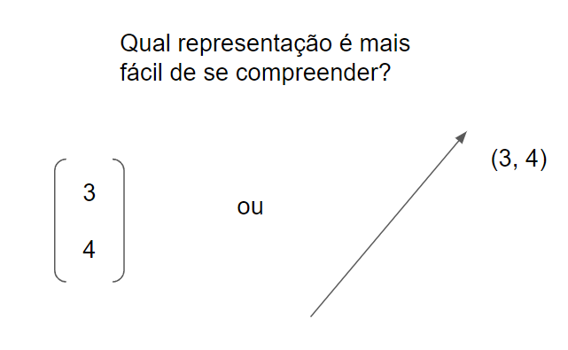
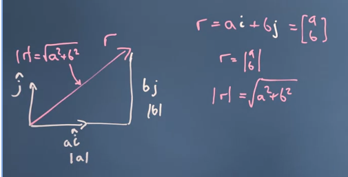
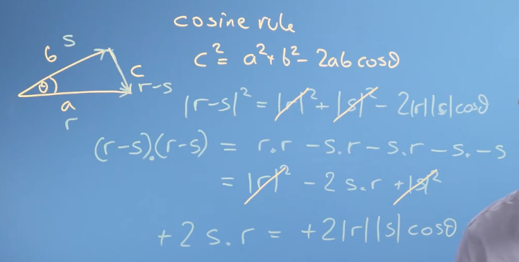
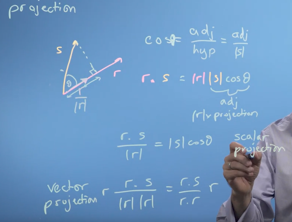
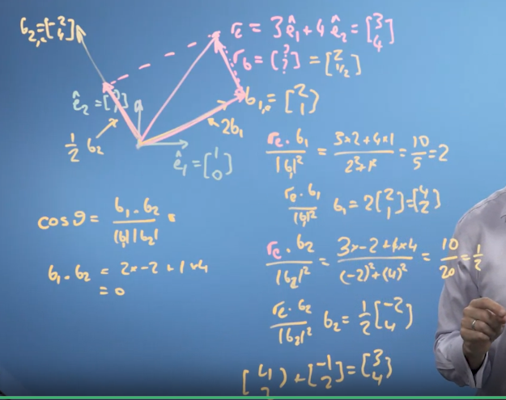
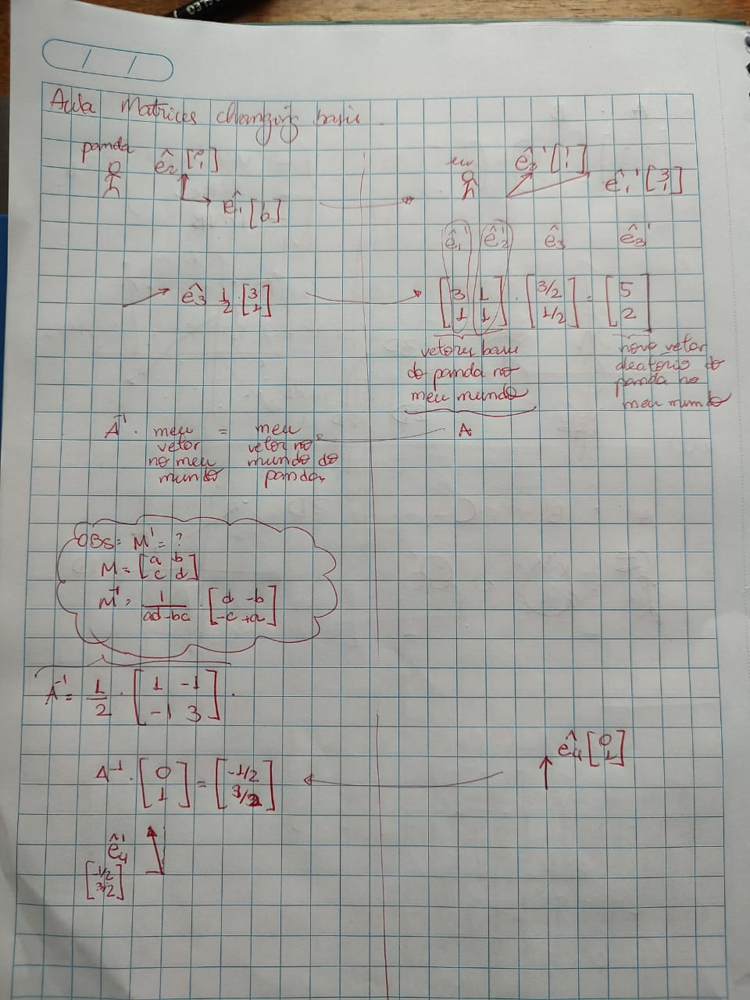
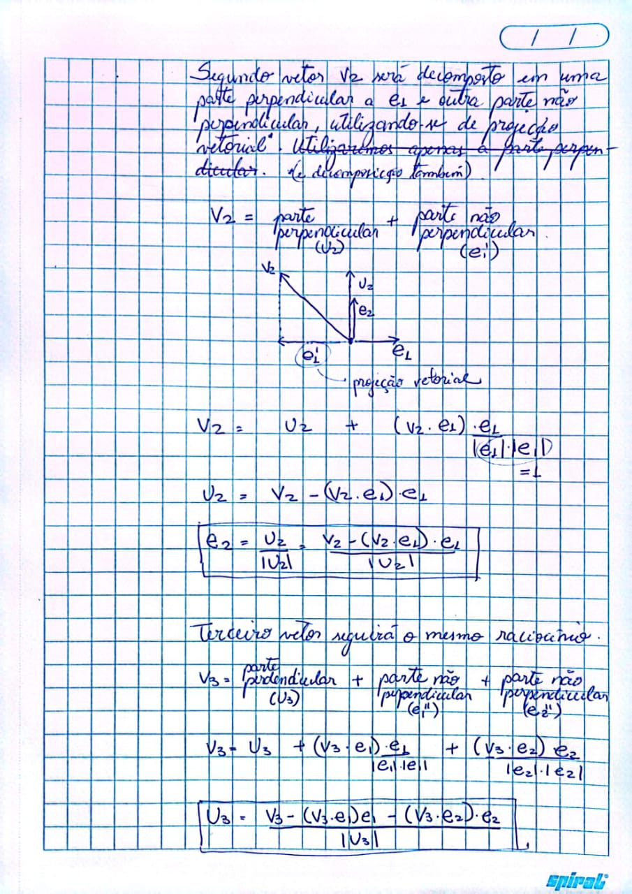

# Álgebra Linear

Definição: representação gráfica da álgebra tradicional.

Por que existe? Uma imagem é mais fácilmente interpretada do que números puros.

## Vetor

Vetor: equivale a um ponto, que necessariamente está inserido em um espaço vetorial. Em outras palavras, um vetor é também uma coordenada.

## Propriedades matemáticas de vetores

### Propriedades básicas

- comutativa: $a * b = b * a$
- distribuitiva: $a(b + c) = ab + ac$
- associativa: $a(b*c) = (a*b)c$ 

### Propriedades avançadas

- Tamanho dos vetores:

A partir do Teorema de Pitágoras, temos que:

$hipotenusa = \sqrt{cateto\ 1^2 + cateto\ 2^2}$ 

A partir das coordenadas da dos pontos, é possível obter o tamanho do vetor. Isso é valioso no contexto de Ciência de Dados pois permite que, a partir de um conjunto de diferentes variáveis, é possível determinar uma medida comum a todas elas. 

- Produto entre vetores:

Como vetores são pontos, a multiplicação de dois vetores resulta em um número escalar.

(obs: a definição acima será usada na parte de projeção)

- Ângulo entre vetores:

A partir da regra de cosseno, temos que:

A novidade é a inclusão do ângulo formado entre dois vetores. Em outras palavras, vetores com direções parecidas tem um maior efeito conjunto, enquanto vetores com direções perpendiculares tendem a se anular.

- Projeção:

Utilizando as definições anteriores de tamanho e cosseno:

Considerando dois vetores diferentes, a projeção permite equiparar ambos em uma escala única. 

Melhor explicação de projeção vetorial: https://matthew-brett.github.io/teaching/vector_projection.html

## Base

A definição usada no curso é:
    
    Base é um conjunto de n vetores:
        (1) linearmente independentes
        (2) infinitos
        (3) n dimensional

As coordenadas do vetor sempre existirão (ex.: (1,2), (4,1,2)), independente da dimensão utilizadas. Contudo, a representação do vetor muda de acordo com os *vetores bases* definidos.

Normalmente para 2 dimensões, os vetores bases são definidos como (1, 0) e (0, 1), sendo os "blocos" utilizados na representação de um vetor. 

Exemplo:

vetor (4, 5) = 4 * (1, 0) + 5 * (0, 1) 

Esses vetores base, contudo, podem ser quaisquer vetores. Consequentemente, a cada conjunto de vetores bases existentes, as representações dos vetores existentes conta com uma representação específica.

A imagem abaixo representa a conversão da representação do vetor r2, cujos vetores base eram e1 e e2, e passaram a ser b1 e b2. Essa operação só foi possível pois garantimos que b1 e b2 são linearmente indepedentes pois $cos\theta = b1 * b2$.

## Matriz

A matriz é usada para transformar o espaço dimensional, resultando na transformação de todos seus ventores.

## Propriedades de matrizes

- matriz (vetor entrada) = vetor saída
- (vetor entrada) * matriz <> vetor saída
- matriz (k * vetor entrada) = k * vetor saída
- matriz (vetor novo + vetor entrada) = matriz (vetor novo) + matriz (vetor entrada)
- matriz identidade * vetor entrada = vetor entrada

## Transformação matricial

Não basta apenas saber os vetores bases de cada espaço vetorial para realizar a transformação matricial. Para isso, é necessário sabermos as coordenadas dos vetores bases do primeiro espaço vetorial traduzidas no segundo espaço vetorial.

## Gram-Schmidt

Como obter espaços ortogonais:

